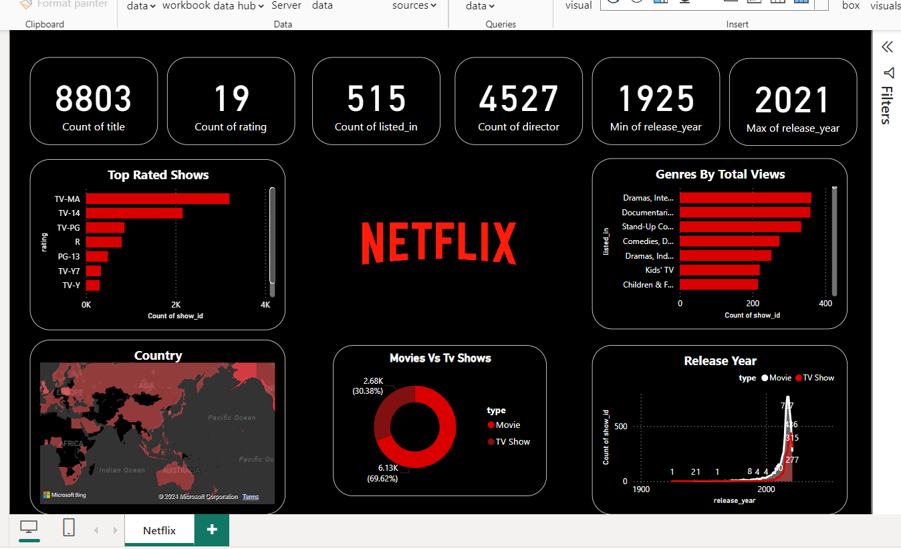

# Painel em Power BI da Netflix

Este repositório contém um painel Power BI abrangente que fornece informações sobre o conjunto de dados da Netflix. O painel visualiza vários aspetos dos dados, como classificações de programas, géneros, distribuição por país e tendências de lançamento.

## Visão geral do painel

O painel inclui as seguintes funcionalidades:

- **Número total de títulos**: uma representação visual da contagem de títulos disponíveis na Netflix.
- **Contagem de classificações**: o número de classificações de conteúdo diferentes representadas no conjunto de dados.
